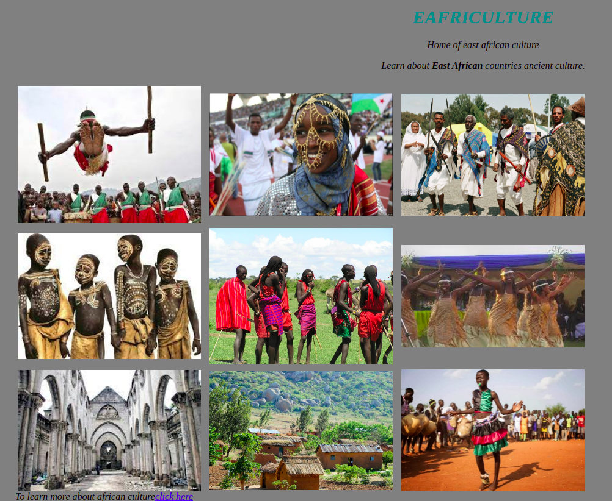

<<<<<<< HEAD
<h1>Photograaph-Website</h1>

This is my first webpage and its a photograph website.

<h2>Description</h2>

This website consists of different East African countries culture photos. Each photo has a link do the concerned country's culture. to learn more about the country's culture in the photo you're needed to just click the photo. The background of this color is grey which is used to portray african culture, native culture. The photos also zoom out on placing the cursor on them. This feature is added for the sake of enabling people who are accessing our website to be able to focus on a specif photo. At the bottom of this webpage we have a link for you to access all african cultures in general.

<h2>Installation</h2>

To open this webpage you are needed to copy this link in your browser https://dev-ccaleb.github.io/Photograaph-Website/

<h2>Specifications</h2>

For this link to work the specifications are a browser application and also internet connection. This link doesnt require any special permissions to work.

<h2>Usage</h2>

To use this website just navigate through the webpage using the vertical scroll bar.To open any of the images just click on the image and you will be redirected.

<h2>Visuals</h2>

This is a screenshot of the webpage.

<h2> Installation</h2>

To open this webpage you are needed to copy this link in your browser https://dev-ccaleb.github.io/Photograaph-Website/

<h2>Contributing</h2>

n a case you have any issue with this project you can always pull a request at the pull request centre. In the near future we will be adding new content so keep intouch with us. This project is open to contributions. If one has any contributions you should state so in the pull request centre and we will reach to you.

We would like to acknowledge Moringaschool and also joshua-barawa they contributed a lot in the complition of this project.

<h1>License</h1>

©2021 dev-cCaleb

=======

>>>>>>> 3909c4d6797baa2583f37e44e08bf5d0cd3393fd
